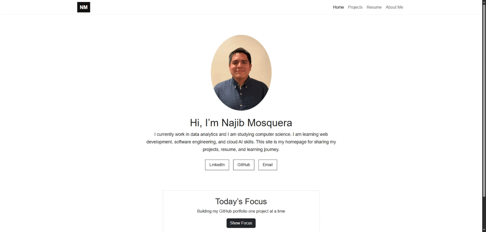

# Najib Mosquera - Personal Homepage

A simple personal homepage created for **CS 5610 Web Development**. This website introduces who I am, shows my projects, includes a resume summary, and has an AI-generated About Me page.

## Project Objective

The goal of this project is to build a front-end only personal homepage using vanilla HTML, CSS, Bootstrap, and JavaScript ES6 modules. The website is designed to be simple, beginner-friendly, and easy to navigate while still meeting the Project 1 requirements.

Extra with JS (Vanilla) feature : I created a Todays focus button that changes to what I am doing during that period of time.

## Live Website

[View my deployed homepage](https://myhomepagenm.netlify.app/)

## Screenshot



## Pages

This website includes four pages:

- `index.html` — Home page with profile photo, short introduction, contact links, and JavaScript feature
- `projects.html` — Projects page with project descriptions, skills used, and GitHub repository links
- `resume.html` — Resume summary page with experience, education, and technical skills
- `about.html` — AI-generated About Me page with a different visual design

## Features

- Responsive navigation bar using Bootstrap 5
- Oval profile image styled with CSS
- Contact links for LinkedIn, GitHub, and email
- Project list with horizontal resume-style sections
- Resume summary page
- AI-generated About Me page with a dark gradient background
- Original JavaScript feature: a button that displays a random learning focus message

## JavaScript Feature

The homepage includes a **Today’s Focus** button. When the user clicks the button, JavaScript randomly chooses one message from a list and updates the text on the page.

This feature uses ES6 modules:

- `main.js` imports the message list.
- `focusMessages.js` exports the array of messages.

Example:

```js
import {focusMessages} from "./focusMessages.js";
```

## Tech Requirements

This project uses:

- HTML5
- CSS3
- Bootstrap 5
- Vanilla JavaScript
- ES6 modules
- Git and GitHub
- Netlify for deployment
- ESLint
- Prettier
- MIT License

## Folder Structure

```text
project-folder/
  index.html
  projects.html
  resume.html
  about.html
  LICENSE
  package.json
  eslint.config.js
  css/
    styles.css
  js/
    main.js
    focusMessages.js
  img/
    favicon.svg
    profilePic.jpg
    updatedgif.gif
```

## How to Install and Run Locally

1. Clone the repository:

```bash
git clone https://github.com/NHazelJ/MyHomePage.git
```

2. Move into the project folder:

```bash
cd MyHomePage
```

3. Install dependencies:

```bash
npm install
```

4. Start a local server:

```bash
npx http-server -p 3000
```

5. Open the website in the browser:

```text
http://192.168.1.81:3000
```

## How to Use the Website

Use the navigation bar to move between pages:

- Home
- Projects
- Resume
- About Me

On the homepage, click the **Show Focus** button to see a random learning goal.

## Project Requirements Checklist

- [x] Personal homepage with meaningful information
- [x] Skills, projects, resume, and contact information
- [x] W3C-friendly semantic HTML
- [x] Bootstrap 5
- [x] At least two HTML pages with different URLs
- [x] Third AI-generated page
- [x] Vanilla JavaScript feature
- [x] ES6 modules
- [x] Organized CSS and JS folders
- [x] Images include alt text
- [x] MIT License
- [x] package.json included
- [x] ESLint config included


### How AI Was Used

AI helped with:

- Explaining JavaScript ES6 modules.
- Helping design the AI-generated About Me page.
- Helping write this README file.
- Helping understand some html elements.

### AI-Generated Page

The `about.html` page was intentionally created with AI assistance. It has a different design from the rest of the website, including a dark gradient background and AI-style content sections.
ChatGPT, GPT-5.5 Thinking were used.

### Example Prompt Used

```text
Act as expirience software engineer and help me create an AboutMe page for my homepage for CS 5610 Web Development project 1.
Use HTML5, CSS3, Bootstrap and ES6+. Make it stylish so it can standout.
```

## Video Demonstration

[View my Demo of my Home Page](https://youtu.be/8hh2cmlz9Fs)

## Class Reference

This project was created for class CS 5610 Web Development

**CS 5610 Web Development**  
Instructor/class website link: [John Alexis Guerra Gómez](https://johnguerra.co/)

## Author

**Najib Mosquera**

- GitHub: [NHazelJ](https://github.com/NHazelJ)
- LinkedIn: [Najib Mosquera](https://www.linkedin.com/in/najib-h-mosquera)
- Homepage: [My HomePage link](https://myhomepagenm.netlify.app/)

## License

This project uses the MIT License.
